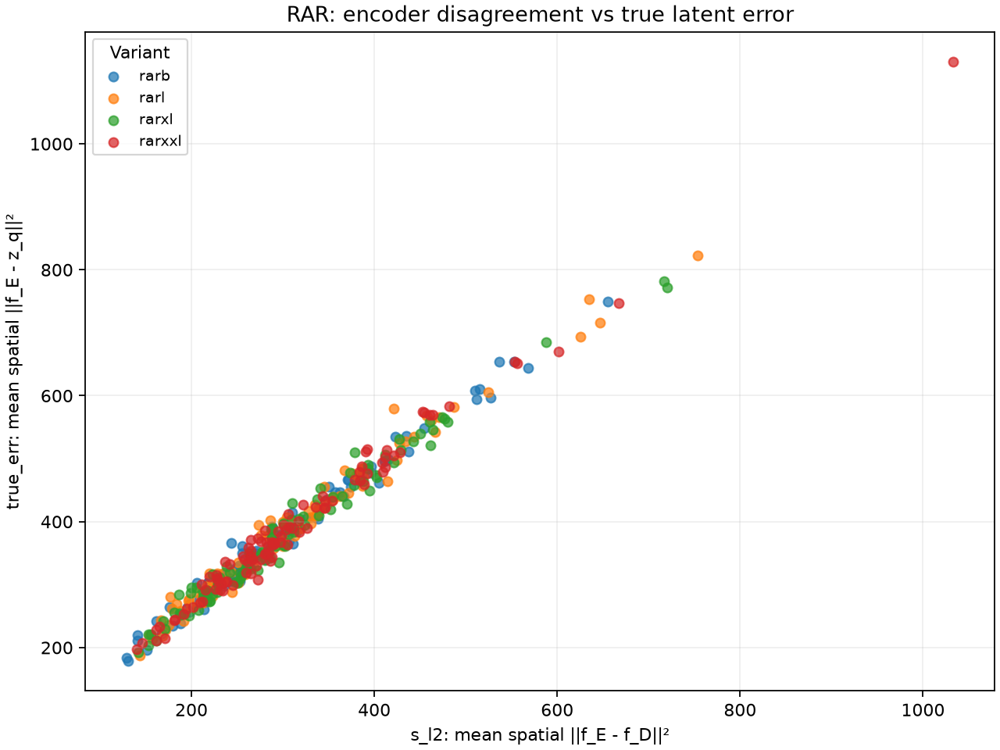
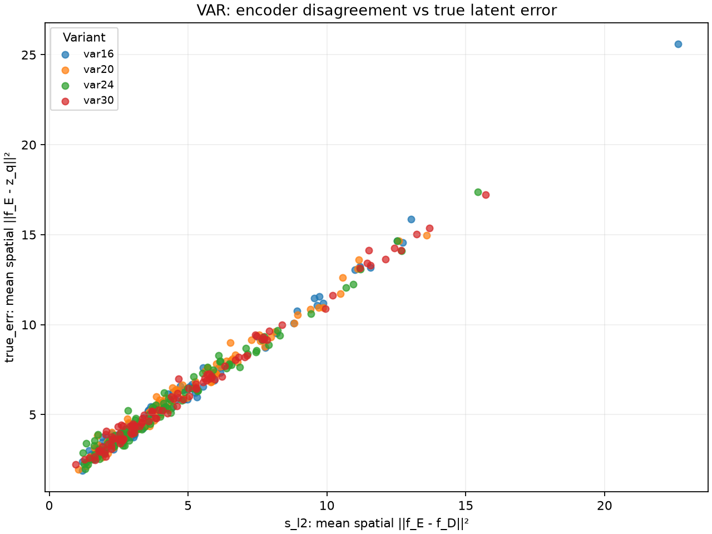
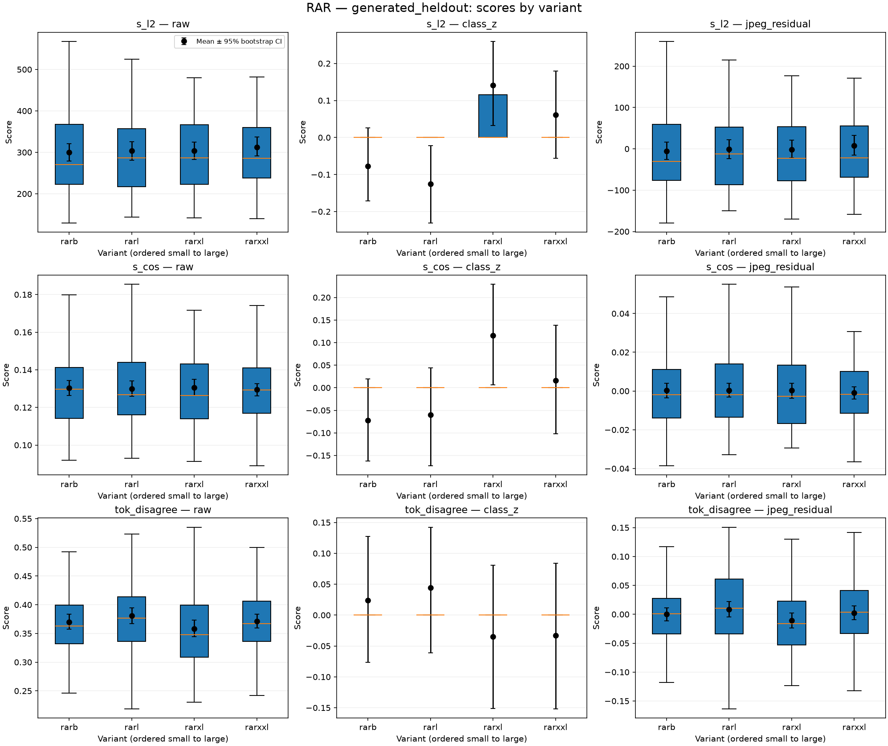
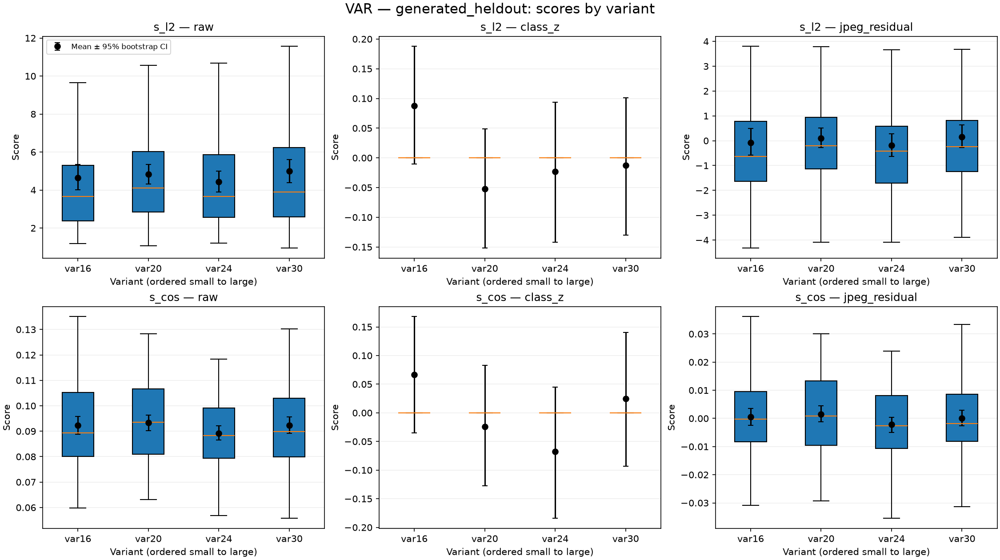
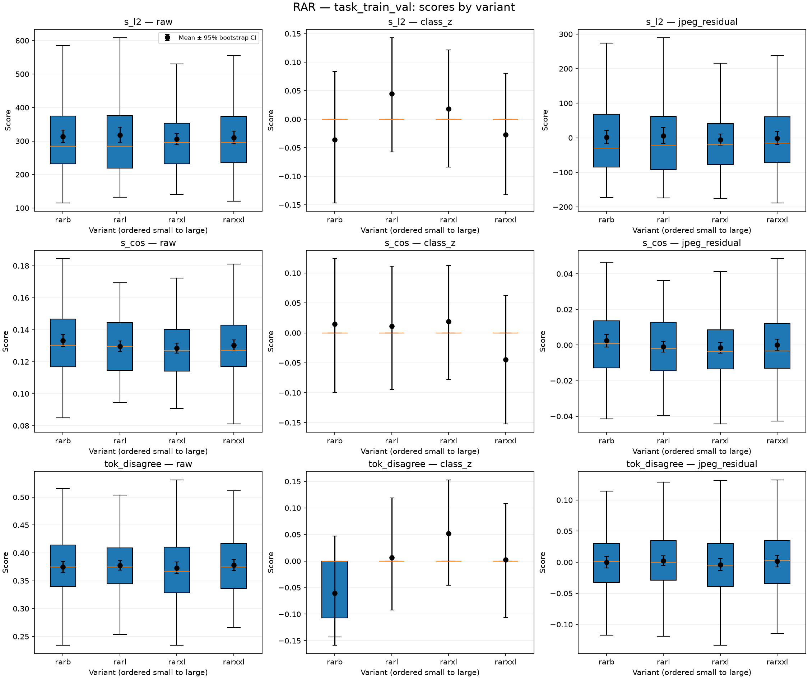
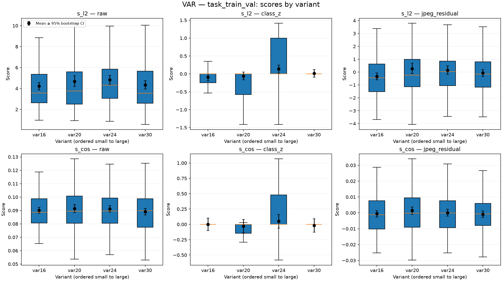

# Stage 3 findings: encoder disagreement

## Hypothesis and evaluation

For an image generated from latent/codebook representation \(z_q\), the original encoder's distance to the
fine-tuned inverse decoder,
\[
s_{\mathrm{l2}}(x)=\operatorname{mean}_{h,w}\|f_E(x)-f_{D^{-1}}(x)\|_2^2,
\]
would proxy the original encoder's true latent error
\(\operatorname{mean}_{h,w}\|f_E(x)-z_q\|_2^2\), and could separate model variants within a family.
The cosine-distance analogue is `s_cos`; RAR also has token disagreement `tok_disagree`.

The experiment plan registered these criteria before evaluation:

- **Proxy validity:** Spearman correlation of `s_l2` with true latent error at least 0.70 on generated images held
  out from inverse-decoder training.
- **Variant signal:** after class and image-complexity normalization, every adjacent-variant AUC at least 0.60
  and the smallest-to-largest (“extreme”) pair AUC at least 0.70, separately per family.
- Larger variants are the positive class; because lower disagreement is the hypothesized signal, pairwise AUC
  uses `-score`.

Generated evaluation contains 100 held-out images for each of four variants per family. Task in-distribution
analysis pools the task train and val images for those variants (outliers excluded). The class normalization
uses stored true ImageNet IDs for generated images and pretrained torchvision ResNet-50 top-1 predictions for
task images. Complexity normalization is the residual after linear regression on log JPEG-q90 file size.

## Proxy check (held-out generated images)

| Family | Score vs true error | Spearman | Pearson | Mean `true_err_Dinv` / mean `true_err` |
|---|---|---:|---:|---:|
| RAR | `s_l2` | 0.987 | 0.991 | 26.99% |
| RAR | `s_cos` | 0.680 | 0.680 | — |
| VAR | `s_l2` | 0.986 | 0.994 | 20.98% |
| VAR | `s_cos` | 0.796 | 0.810 | — |

The registered proxy criterion **passes for `s_l2` for both families**. `s_l2` tracks the original encoder's
true error closely, although the inverse decoder itself still accounts for about 27% of that mean error for RAR
and 21% for VAR. These correlations validate error tracking, not variant discrimination.

## Variant separation (`s_l2`)

Each cell is **worst adjacent-pair AUC / extreme-pair AUC**. The adjacent value is the minimum over the three
neighboring pairs, so it tests the registered requirement that all adjacent pairs clear the cutoff. Raw values
are a reference; class-z and JPEG residual are each evaluated against the registered normalized thresholds.

| Family | Cohort | Raw | Within-class z-score | JPEG-size residual |
|---|---|---:|---:|---:|
| RAR | Held-out generated | 0.480 / 0.461 | 0.391 / 0.439 | 0.480 / 0.466 |
| RAR | Task train + val | 0.486 / 0.495 | 0.464 / 0.491 | 0.486 / 0.494 |
| VAR | Held-out generated | 0.443 / 0.457 | 0.489 / 0.542 | 0.431 / 0.443 |
| VAR | Task train + val | 0.444 / 0.500 | 0.418 / 0.455 | 0.450 / 0.452 |

**Neither family meets the variant-signal criterion under either normalization, on generated or task images.**
The pairwise AUCs are mostly at or below chance. Ordering scores also show little monotonic relationship with
variant index: held-out raw `s_l2` Spearman is 0.045 for RAR and 0.025 for VAR; task train+val raw values are
0.007 and 0.023, respectively. The desired direction would be negative.

The notebook also plots distributions and reports means with 95% bootstrap confidence intervals for every
variant, metric, cohort and normalization, and calculates every pairwise AUC for `s_l2`, `s_cos`, and (RAR)
`tok_disagree`.

### Distribution figures

## Task impact and conclusion

Stage 2 validation reached **96.0% family accuracy**, **31.6% overall 9-class accuracy**, and **25.3% variant
accuracy conditional on correct family**. Because neither family passed the pre-registered variant-separation
gate, no within-family variant classifier was trained or evaluated; there is therefore no measured improvement
over those Stage 2 task metrics.

- **RAR:** proxy check passes; variant separation fails. Disagreement is a strong proxy for encoder latent error,
  but is not a useful variant-size signal under the tested normalizations.
- **VAR:** proxy check passes; variant separation fails. Disagreement tracks latent error, but does not reliably
  order or distinguish VAR depths.

**Overall:** the error-proxy hypothesis is supported, but the proposed use of disagreement for identifying
within-family variants is not supported by this experiment.
